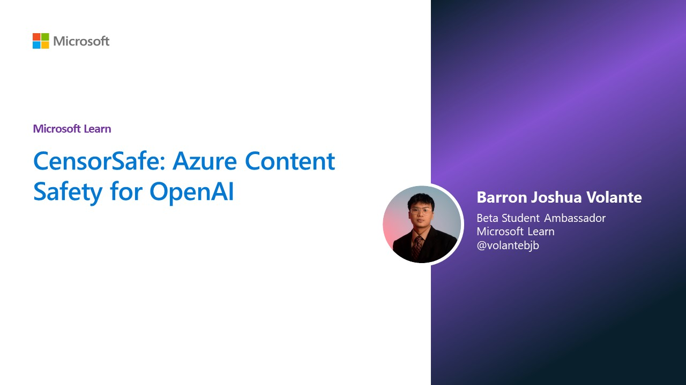

# CensorSafe



CensorSafe is a basic web application that utilizes the Azure Content Safety API to analyze text and images for potential offensive content. The application is built using Flask, a web framework for Python.

## Prerequisites
Before running the application, ensure you have the necessary dependencies installed. You can install them using:

```bash
pip install -r lib/requirements.txt
```

Create a .env file in the project directory and provide your Azure Content Safety API endpoint and key:

```env
AZURE_CONTENTSAFETY_ENDPOINT=your_endpoint_url
AZURE_CONTENTSAFETY_KEY=your_api_key
```

## Usage
Run the application:
```bash
python app.py
```

Open your web browser and go to http://localhost:5000.

Enter text or upload an image to analyze.